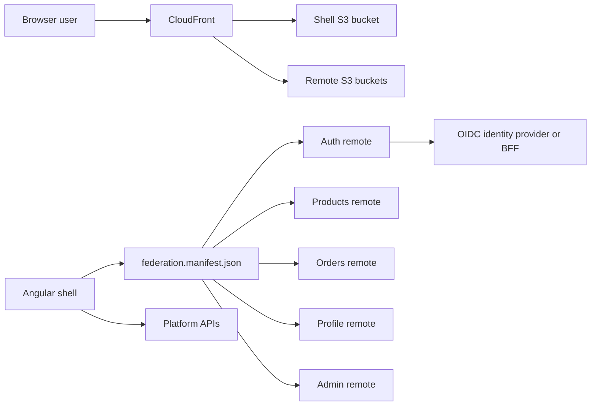
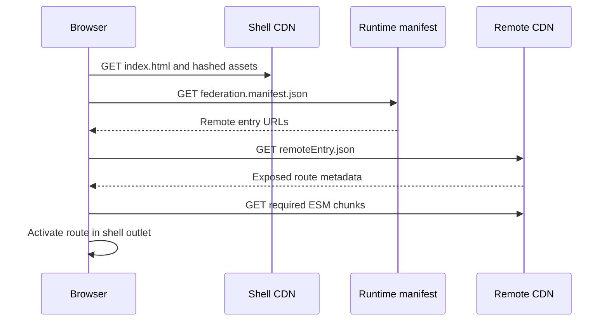

# Northstar platform architecture

## Purpose

Northstar is a production-oriented reference platform for independently built and deployed Angular micro-frontends. It uses Angular 20, Nx 21, native federation, standalone components, signals, RxJS, SCSS, Jest, Playwright, GitHub Actions, Nx Cloud, Docker, Amazon S3, and CloudFront.

The architecture optimizes for team autonomy and independent releases while retaining one coherent browser application. Micro-frontends are not used to reduce JavaScript by default; they deliberately trade additional runtime and operational complexity for ownership and release isolation.

## System context



The browser first loads the shell. The shell reads a runtime federation manifest and resolves remote entry points without rebuilding itself. CloudFront serves the static artifacts backed by separate S3 origins. Application APIs and the production identity provider are external boundaries; the repository currently uses in-memory sample data and a demo JWT flow.

## Runtime composition

The shell is the composition root. It owns the application frame, top-level navigation, global providers, route policy, and loading of remote route tables. Each remote exposes a narrow `Routes` contract through native federation.



Native federation was selected over webpack Module Federation because it preserves Angular's esbuild-based toolchain and composes browser-standard ES modules through import maps. Nx's webpack federation remains a valid alternative for organizations that prioritize its mature generator ecosystem or webpack-specific integrations.

Angular, RxJS, and shared workspace packages are strict-version singletons. This is a correctness constraint, not only a bundle optimization: duplicate Angular runtimes can create different injector identities and split supposedly global signal state.

The `es-module-shims` polyfill is included in every application because native federation emits module-shim scripts for import-map compatibility. Removing it can leave the document loaded while Angular never bootstraps, producing a blank page.

## Application topology

| Application | Local port | Responsibility | Access policy |
| --- | ---: | --- | --- |
| `shell` | 4200 | Composition, navigation, global providers | Public |
| `auth` | 4201 | Demo sign-in and session establishment | Public |
| `products` | 4202 | Product catalogue | Public |
| `orders` | 4203 | Order history | Authenticated |
| `profile` | 4204 | User profile | Authenticated |
| `admin` | 4205 | Administrative features | `admin` role |

The source layout is intentionally asymmetric: the shell follows the conventional `apps/` layout, while the remotes are top-level Nx projects. Nx project metadata, rather than directory depth, defines dependency and task boundaries.

```text
apps/
  shell/                     browser composition root
  shell-e2e/                 Playwright journeys
auth/                        authentication remote
products/                    catalogue remote
orders/                      orders remote
profile/                     profile remote
admin/                       administration remote
libs/shared/
  models/                    framework-light contracts
  auth-data-access/          session store, guards, interceptor
  api-client/                typed HTTP boundary
  ui/                        shared platform chrome
  util-config/               runtime configuration token
tools/                       manifest and deployment scripts
.github/workflows/           CI and independent deployment
docs/                        supporting architectural notes
```

Domain behavior stays inside the owning remote. Code is promoted to `libs/shared` only after it has stable semantics and at least two genuine consumers. This avoids turning a micro-frontend platform into a distributed monolith with synchronized releases.

## Dependency boundaries

Nx tags encode architectural intent:

- Applications use `type:app` and a domain-specific `scope:*` tag.
- Shared libraries use `scope:shared` plus `type:model`, `type:data-access`, `type:ui`, or `type:util`.
- ESLint dependency constraints prevent feature domains from reaching into another domain's implementation.
- Remotes communicate through URL navigation, exposed route contracts, shared platform contracts, or backend APIs—not direct imports from another remote.

Adding a dependency to a shared library expands the coordinated change surface. Shared packages therefore require backward-compatible contracts and should not contain domain orchestration.

## State and asynchronous work

Signals model synchronous application state and derived UI state. The authentication store uses signals for the current token, decoded user, authentication status, and roles. Standalone components consume those signals directly with `OnPush` change detection.

RxJS remains the boundary for HTTP, cancellation, retries, event streams, and workflows with temporal behavior. A practical rule is:

- Use a signal when the UI needs a current value.
- Use an observable when the behavior is fundamentally a sequence over time.
- Convert at ownership boundaries instead of mirroring every value in both abstractions.

Remote-local state belongs to its remote. Cross-remote browser state should be rare, small, and owned by a stable shared service. Durable business state belongs on the server.

## Authentication and trust boundaries

The current authentication remote creates a synthetic JWT so the workspace runs without an external identity system. `AuthStore` validates the token shape and expiry, restores it from `sessionStorage`, and exposes derived role state. Route guards prevent inappropriate client navigation, while the HTTP interceptor attaches the bearer token only to the configured API origin.

This implementation is demonstrative, not a production identity boundary:

- Client-side guards improve user experience but do not authorize data access.
- Every API must validate token signature, issuer, audience, expiry, and authorization claims.
- The browser must never contain a signing secret.
- Production should use Authorization Code with PKCE through a trusted OIDC provider.
- A backend-for-frontend with `HttpOnly`, `Secure`, and appropriate `SameSite` cookies is preferred when the deployment model allows it.
- If bearer tokens are necessary, use short-lived in-memory access tokens and refresh-token rotation rather than long-lived `localStorage` credentials.

The interceptor deliberately scopes credentials to the configured API origin. Requests to remote CDNs and arbitrary third-party URLs must not receive the access token.

## Build and local development

Use the Node version declared in `.nvmrc`, then install from the lockfile:

```bash
nvm use
npm ci
```

Each application can run independently:

```bash
npx nx run auth:federation-serve
npx nx run products:federation-serve
npx nx run orders:federation-serve
npx nx run profile:federation-serve
npx nx run admin:federation-serve
npx nx run shell:federation-serve
```

The committed development manifest points the shell to localhost ports 4201–4205. Production builds use `federation-build`; `tools/generate-federation-manifest.mjs` creates deployment URLs from `MFE_ORIGIN`.

Useful validation commands are:

```bash
npm run build:mfes
npm test
npm run e2e
npm run graph
```

## Testing strategy

The test pyramid is split by responsibility:

- Jest unit tests cover stores, token parsing, interceptors, components, and pure domain behavior.
- Contract tests should verify every remote still exposes the route module expected by the shell.
- Playwright exercises user journeys through the composed shell, including remote loading, authentication redirects, and role-based navigation.
- Production smoke tests should fetch `index.html`, the runtime manifest, every `remoteEntry.json`, and one critical route after deployment.

Remote tests should avoid importing another remote's implementation. Shared libraries are tested as public contracts. A future API layer should use deterministic mocks for browser tests and consumer-driven contracts for independently released backends.

## CI architecture

GitHub Actions computes the affected project graph from `NX_BASE` and `NX_HEAD`. The quality job runs linting, Angular builds, native-federation builds, Jest, and Playwright. Nx provides three distinct optimizations:

1. `nx affected` removes projects unrelated to the change.
2. Nx Cloud remote cache reuses matching task outputs across runners and branches.
3. Nx Cloud distributed execution shortens the critical path by assigning tasks to multiple agents.

These mechanisms complement one another; caching does not replace affected analysis, and distribution does not improve a task that already has a cache hit.

Required GitHub configuration includes:

| Name | Kind | Purpose |
| --- | --- | --- |
| `NX_CLOUD_ACCESS_TOKEN` | Secret | Authenticates remote cache and distributed execution |
| `AWS_DEPLOY_ROLE_ARN` | Secret | GitHub OIDC role assumed by the workflow |
| `S3_BUCKETS_JSON` | Secret | Maps application names to buckets |
| `CLOUDFRONT_DISTRIBUTIONS_JSON` | Secret | Maps applications to distributions |
| `AWS_DEPLOY_ENABLED` | Variable | Set to `true` only after AWS deployment configuration is complete |
| `AWS_REGION` | Variable | AWS deployment region |
| `MFE_ORIGIN` | Variable | Public origin used in the generated manifest |

GitHub OIDC avoids long-lived AWS access keys. The AWS role should trust only the intended repository, branch/environment, buckets, and CloudFront distributions.

## Deployment and caching

Each application has an independent S3 bucket and CloudFront distribution. The deployment matrix builds and deploys each affected application separately.

Hashed JavaScript, CSS, and media are uploaded first with a one-year immutable cache policy. Mutable entry points are uploaded last with `no-cache` semantics:

- `index.html`
- `remoteEntry.json`
- `federation.manifest.json`

This ordering prevents an entry point from referencing chunks that have not reached the CDN yet. The shell manifest acts as the release control plane: changing a remote URL can promote or roll back a release without rebuilding the shell.

The preferred production evolution is to deploy artifacts under versioned prefixes, run smoke tests against the immutable version, and atomically promote the manifest. Keep previous versions available until rollback windows expire.

## Docker

The Docker image builds the shell and serves static files with nginx. It is useful for local production-like validation and environments that deploy containers. The primary independent-deployment design remains S3 plus CloudFront; a single shell container does not replace separately addressable remote artifacts.

## Resilience and observability

Remote loading is a network operation and must be treated as fallible. Production increments should add:

- Route-level error boundaries with retry and support correlation details.
- Timeouts and useful fallback UI when a remote entry cannot load.
- Structured browser telemetry for shell version, remote versions, route, and correlation ID.
- Content Security Policy aligned with every approved remote origin.
- Synthetic probes for manifests, remote entries, and critical journeys.
- Deployment annotations so runtime failures can be correlated with releases.

The shell should remain usable when a non-critical remote is unavailable. Authentication and navigation failures require explicit behavior because they affect the whole platform.

## Architecture decisions and trade-offs

### Native federation instead of webpack federation

Native federation aligns with Angular's modern build pipeline and browser ESM. The cost is a younger operational ecosystem and explicit import-map compatibility handling.

### Route-level exposure instead of component-level exposure

Routes give each domain control over its internal navigation and reduce the shell/remote contract surface. Exposing many small components would increase runtime requests and cross-team coupling.

### Monorepo with independent deploys

Nx gives atomic refactoring, one dependency graph, consistent tooling, and affected builds. Independent S3 artifacts preserve release autonomy. Repository access and CI ownership must still be governed so a monorepo does not imply universal ownership.

### Shared Angular runtime

Singleton sharing reduces duplication and preserves DI identity, but it creates a platform-level compatibility window. Angular major-version upgrades require coordinated planning even though feature releases remain independent.

### Runtime manifest

Runtime discovery enables independent promotion and rollback. It also means configuration is production code: manifests require validation, controlled writes, short caching, monitoring, and an audit trail.

## Ownership and change policy

Each remote should have a named owning team, CODEOWNERS rules, service-level objectives, and a release dashboard. Platform owners govern the shell, shared libraries, federation contract, CI templates, and deployment tooling.

A change requires coordinated review when it modifies:

- A shared library's public API.
- The remote exposure contract.
- Authentication or authorization behavior.
- The runtime manifest schema.
- CDN cache behavior or deployment ordering.
- Angular, RxJS, Nx, or federation major versions.

## Evolution roadmap

1. Replace demo authentication with OIDC/PKCE or a BFF and test refresh concurrency.
2. Introduce domain data-access libraries and typed backend contracts.
3. Add remote-load fallbacks, telemetry, CSP, and release correlation IDs.
4. Add compatibility checks between the shell and independently promoted remotes.
5. Deploy versioned artifact prefixes and atomic manifest promotion/rollback.
6. Add CODEOWNERS, dependency-update policy, security scanning, and production smoke gates.

## Interview talking points

- Micro-frontends primarily buy organizational and release autonomy; they are not automatically faster or smaller.
- The shell owns composition, while remotes own domain behavior and expose narrow route contracts.
- Strict singleton sharing protects Angular injector and state identity, but creates an explicit framework compatibility policy.
- Signals are well suited to current synchronous UI state; RxJS remains stronger for cancellation and event sequences.
- The runtime manifest decouples shell builds from remote promotion and becomes the safest rollback lever.
- `nx affected`, remote caching, and distributed task execution solve different CI bottlenecks.
- S3 upload order and CloudFront cache headers are correctness concerns, not merely performance tuning.
- Client guards never replace API authorization.
- Independent deployment requires independent observability, compatibility checks, and ownership—not only separate build commands.
